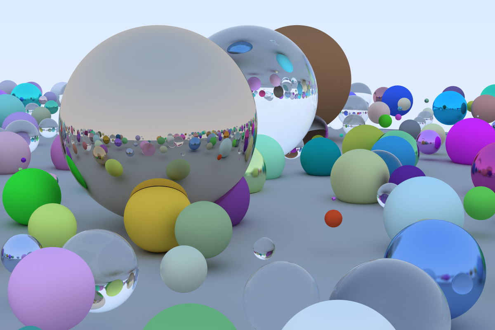

# Raytracer in rust

Following the great [Ray Tracing in One Weekend](https://raytracing.github.io/)

Work in progress: 1 / 3 weekends



## Running the raytracer

```
cargo run --release > image.ppm
```